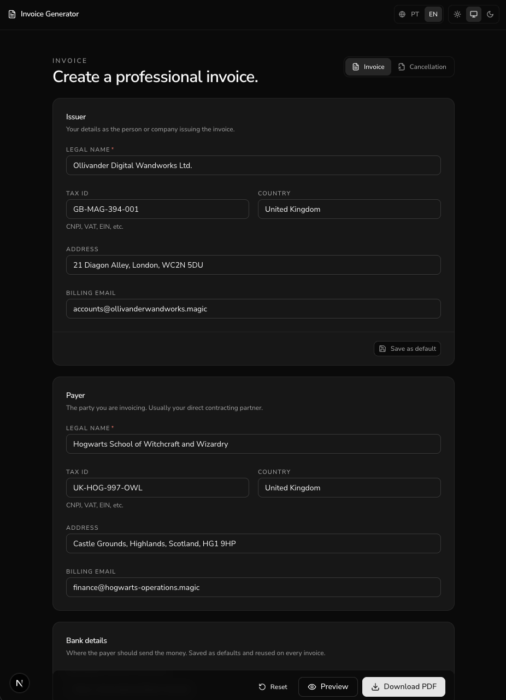
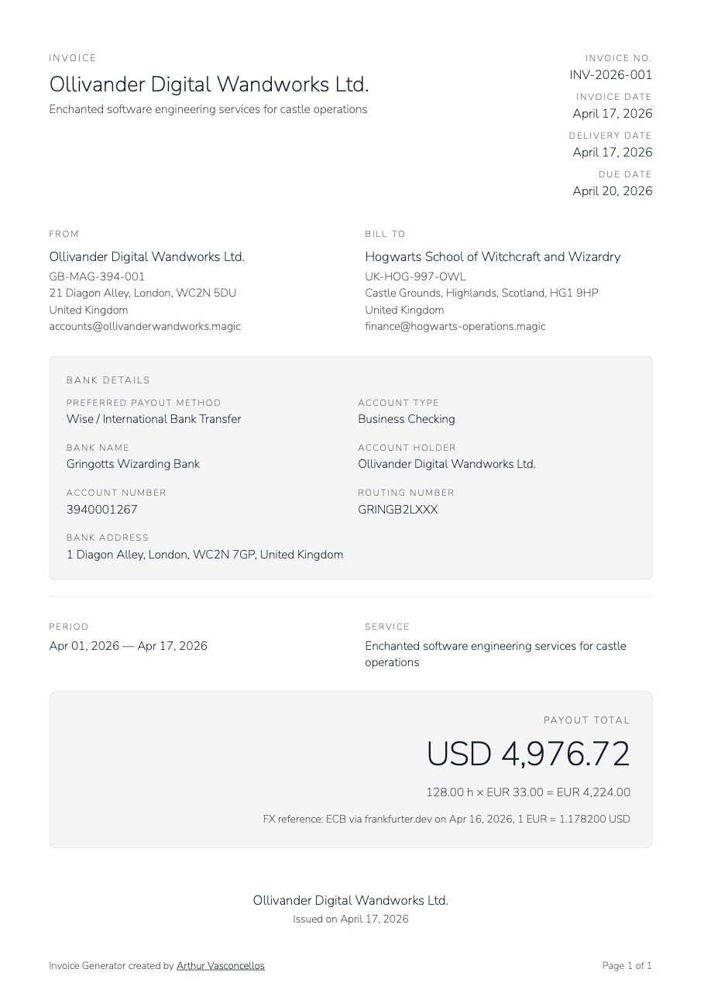

<h1 align="center">Invoice Generator - AV LABS</h1>

<p align="center">
  <strong>Live at <a href="https://invoice.arthurvasconcellos.com">invoice.arthurvasconcellos.com</a> - part of <a href="https://arthurvasconcellos.com">AV LABS</a>.</strong>
</p>

<p align="center">
  <a href="#-running">Running</a>&nbsp;&nbsp;&nbsp;|&nbsp;&nbsp;&nbsp;
  <a href="#-technologies">Technologies</a>&nbsp;&nbsp;&nbsp;|&nbsp;&nbsp;&nbsp;
  <a href="#-license">License</a>
</p>

<p align="center">
  <a href="#-license">
    
  </a>
</p>

<p align="center">
Invoice Generator is a local-first, browser-only PWA for contractors who bill foreign companies. It produces deterministic, branded invoice and cancellation PDFs, persists drafts to <code>localStorage</code>, and never talks to a backend you have to run.
</p>


|                App Preview                 |                  PDF Preview                   |
| :----------------------------------------: | :--------------------------------------------: |
|  |  |


## 🚀 Features

- ✅ **Two document types** - invoice (`INV-YYYY-NNN`) and cancellation (`CN-YYYY-NNN`) with auto-negated totals on cancellation.
- ✅ **Distinct issuer and payer** parties with full address blocks.
- ✅ **Currency-aware** - contract currency + payout currency. The FX section appears only when they differ, auto-fetches the latest ECB-sourced rate from frankfurter.dev, and accepts a manual override.
- ✅ **Bank details** persisted in settings and rendered in the PDF below the parties block.
- ✅ **Strong form ergonomics** - invalid fields highlight in red and the page jumps to the first invalid input on submit.
- ✅ **Internationalised** - `pt-BR` and `en` across UI and PDF output.
- ✅ **Local-first persistence** - draft, issuer defaults, bank defaults, and a 6-hour FX cache live in `localStorage`. No backend, no accounts, no sync.
- ✅ **Deterministic PDF filenames** - `<type>-<number>-<issueDate>.pdf`. The hero amount (payout when FX is present, otherwise contractual) reads as the most prominent line.
- ✅ **Installable PWA** with offline support after first load.
- ✅ **Built-in bug report** - opens a pre-filled GitHub issue with optional technical context. Maintainer email never enters source.

## 💻 **Running**

### **Requirements**

- `node >= 22` (Node 24 recommended)
- `pnpm`

#### 1️⃣ Clone the Repository

```bash
git clone https://github.com/arthursvpb/invoice-generator.git
cd invoice-generator
```

#### 2️⃣ Install dependencies

```bash
pnpm install
```

#### 3️⃣ Start the dev server

```bash
pnpm dev
```

The app runs at `http://localhost:3000/invoice` (`/` redirects).

### **Other scripts**

```bash
pnpm typecheck     # tsc --noEmit
pnpm lint          # eslint .
pnpm test          # vitest run (76 unit tests)
pnpm build         # next build (also generates public/sw.js for PWA)
pnpm e2e           # playwright test (68 scenarios, headless Chromium)
pnpm e2e:ui        # Playwright UI mode
pnpm format        # prettier --write .
```

Regenerating PWA icons from the SVG source:

```bash
node scripts/generate-icons.mjs
```

## ✍️ **Digital signing**

The app does not embed cryptographic signatures. The PDF reserves a centered signature placement and populates PDF metadata (`Producer`, `Author`, `Title`, `Subject`) so external signers attach cleanly.

Recommended external flow:

1. Export the PDF.
2. Upload to a platform signer (D4Sign, Adobe Sign, Assinafy).
3. Sign with your existing ICP-Brasil or eIDAS certificate.
4. Distribute the signed file.

## ✨ **Technologies**

- **Framework** - Next.js 15 (App Router), React 19, TypeScript
- **Styling** - Tailwind v4, shadcn primitives, Nunito Sans
- **Forms & validation** - react-hook-form, zod, big.js (decimal math)
- **State** - zustand (persisted draft + settings stores)
- **PDF** - `@react-pdf/renderer` with locally bundled fonts
- **FX** - frankfurter.dev (ECB-sourced reference rates, browser CORS friendly)
- **PWA** - Serwist service worker
- **Internationalisation** - custom dictionary + `Intl.NumberFormat`/`DateTimeFormat`
- **Testing** - Vitest + @testing-library, Playwright (Chromium)

## 📝 **License**

This project is under the MIT license. See the [LICENSE](LICENSE) file for more details.
